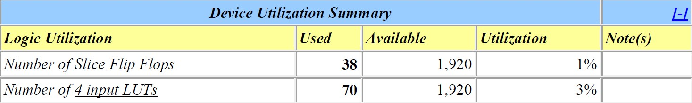

# VHDL Circuit
Circuito em VHDL feito para a disciplina de Sistemas Digitais.

#### Divisão do circuito em componentes, as posições estão na forma [coluna, linha]:

O Teste Bench foi criado no ISE para fazer a simulação do circuito projetado. 
A simulação foi dividida em 5 partes, as quais estão em screenshots, com comentários explicativos do processo abaixo da primeira imagem já que as outras tem a mesma explicação de forma análoga.

Caso 1: updown = 0, reset = 0, seletor = 1 (contador crescente e utiliza o resultado do multiplicador para a saída do circuito).

A saída para todo o circuito sempre está com defasagem de 2 ciclos de clock em relação à entrada, mesmo que tenha sido configurado no CoreGenerator para o multiplicador ficar com zero estágios de pipeline para que o multiplicador não tivesse entrada de clock, então sempre que for referenciada a saída em relação às entradas do circuito, considera-se esse fato citado. 
Com a saída do registrador de 8 bits [0,1] em 00000001 e a saída do contador de 8 bits [0,0] em 00000010, updown em 0 (contador crescente na minha implementação), reset em 0 (circuito ativado na minha implementação) e seletor em 1 (utiliza o resultado do multiplicador para o resultado que vai para a saída do circuito), a saída gerada a partir do registrador de 8 bits [3,0] é 00000010, resultado da multiplicação entre as saídas de [0,1] e [0,0].
Esse número entra no conversor Nibble/BCD [4,0]. No conversor [4,0], os 4 bits menos significativos (0010) da saída de [3,0] vão para o display da direita e os 4 bits mais significativos (0000) vão para o display da esquerda. 
Ou seja, em BCD, irá 0 no display da esquerda e 2 no display da direita. Utilizando o componente conversor, o valor gerado para as duas partes do vetor de entrada são: 0000001 e 0010010 para os bits mais significativos e menos significativos, respectivamente. 
Os valores em zero na saída do conversor
significam segmento de display ligado e valores em 1 significam que os segmentos de display em questão estão desligados. 
A ordem utilizada para os segmentos é a,b,c,d,e,f,g em relação aos dados de saída do conversor. A imagem a seguir, ilustra o resultado obtido para esse primeiro caso de simulação.

A seguir, é mostrado outros 4 casos para simular o circuito, porém sem explicação detalhada, como foi dito na página anterior.

Caso 2: updown = 0, reset = 0, seletor = 0 (contador crescente e utiliza o resultado do somador para a saída do circuito).

Caso 3: updown = 1, reset = 0, seletor = 1 (contador decrescente e utiliza o resultado do multiplicador para a saída do circuito).

Caso 4: updown = 1, reset = 0, seletor = 0 (contador decrescente e utiliza o resultado do somador para a saída do circuito).

Caso 5: reset = 1 (a saída do circuito é sempre zerada).

#### Resumo do design do circuito projetado:

A frequência estimada foi de 107.507MHz.

